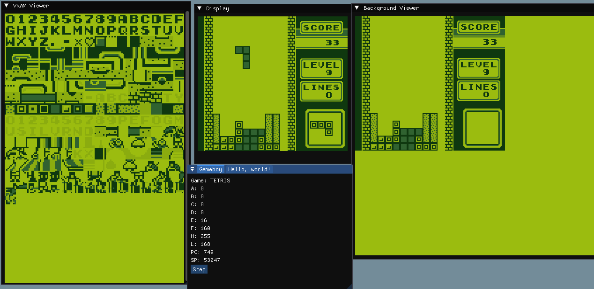

# Game Boy Emulator

**From-scratch Game Boy emulator in C++ featuring debugger tools and support for running select original ROMs such as Tetris.**  
**Status:** _Archived — no longer under active development._

---

## Overview

This project replicates core components of the original Nintendo Game Boy, including the CPU, memory, and graphics pipeline. It was developed as a learning exercise in low-level programming, hardware emulation, and systems development.  

While not intended as a production-quality emulator, it runs several commercial ROMs and includes a suite of debugging tools designed to make the inner workings of the Game Boy easier to explore and understand.  

---

## Features

- **VRAM Viewer**  
  Inspect tiles, sprites, and other graphical data in real time.  

- **Background Viewer**  
  Visualize the Game Boy’s background map as it is rendered.  

- **CPU State Display**  
  Monitor registers, flags, and the current instruction live.  

---

## Controls

-  `W` – Up  
-  `A` – Left  
-  `S` – Down  
-  `D` – Right  

-  `J` – A button  
-  `K` – B button  

- `Enter` – Start  
- `Backspace` – Select  

---

## Research Resources

This project would not have been possible without the documentation and community resources surrounding Game Boy development:  

- **[Game Boy CPU (SM83) Manual](https://rgbds.gbdev.io/docs/v0.9.0/gbz80.7)**  
- **[Pan Docs](https://gbdev.io/pandocs/Specifications.html)**  
- **[The Ultimate Game Boy Talk (YouTube)](https://www.youtube.com/watch?v=HyzD8pNlpwI&ab_channel=media.ccc.de)**  

---

## Tests

The emulator was validated against community-created test ROMs:  

- **Blargg Test ROMs**: [https://github.com/retrio/gb-test-roms](https://github.com/retrio/gb-test-roms)  
- **Mooneye Test Suite**: [https://github.com/Gekkio/mooneye-test-suite](https://github.com/Gekkio/mooneye-test-suite)  
- **CPU Instruction JSON Tests**: [https://github.com/SingleStepTests/sm83](https://github.com/SingleStepTests/sm83)  

---

## External Libraries Used

- **Dear ImGui**: [https://github.com/ocornut/imgui](https://github.com/ocornut/imgui)  
- **tinyfiledialogs**: [https://sourceforge.net/projects/tinyfiledialogs/](https://sourceforge.net/projects/tinyfiledialogs/)  
- **OpenGL** – graphics rendering  
- **SDL2** – window management and input  

---

## Known Limitations

- Timer implementation is not cycle-accurate.  
- Only supports ROMs without a Memory Bank Controller (MBC).  
- Audio is not implemented.  
- Certain timing and PPU edge cases remain inaccurate.  
---

## License

This project is released under the [MIT License](LICENSE).  
